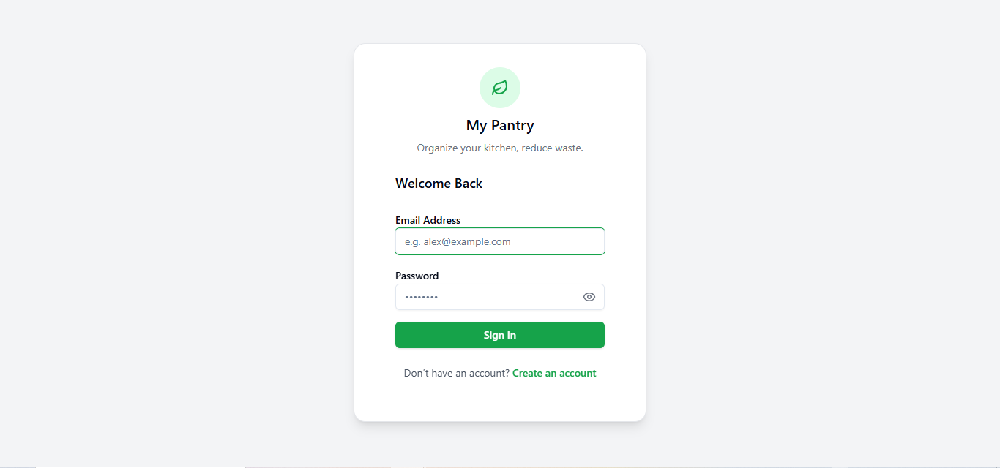
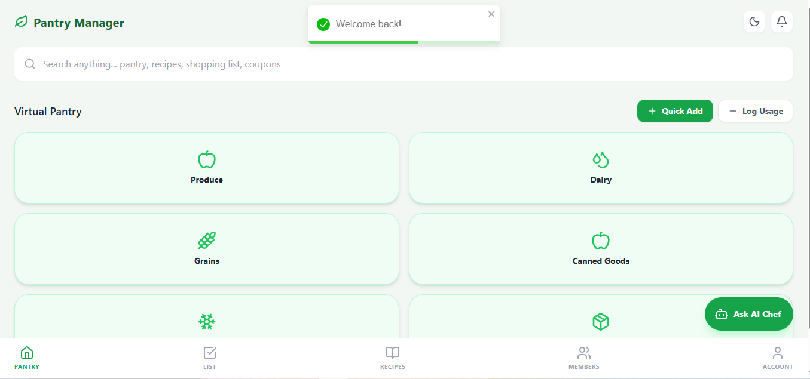
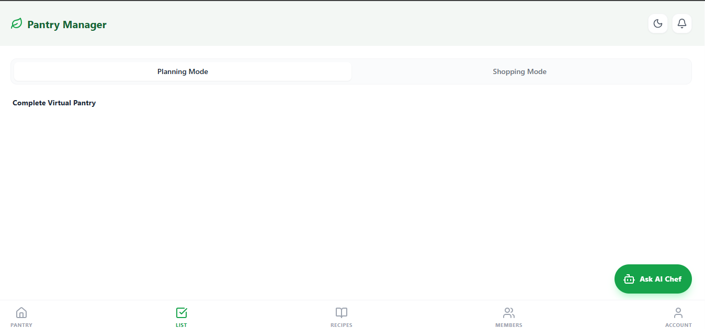
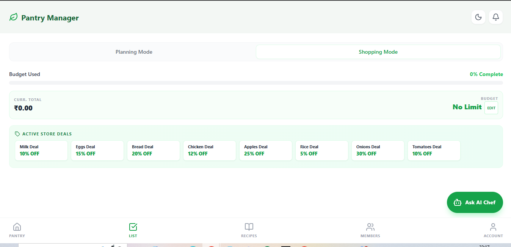
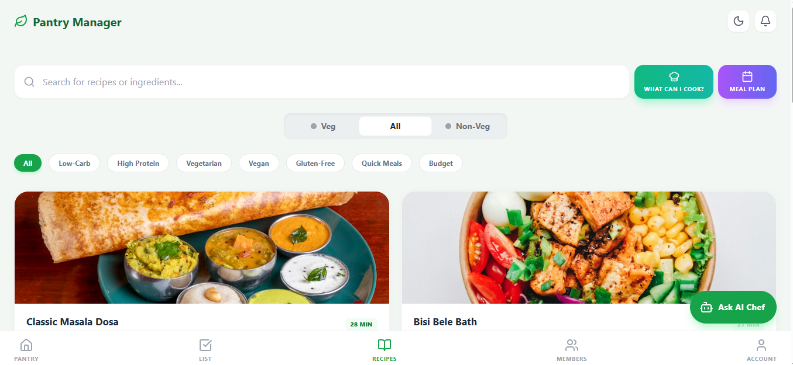
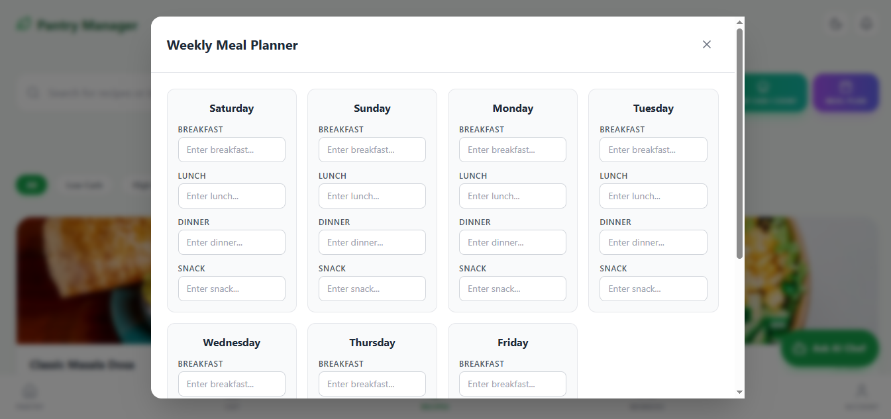
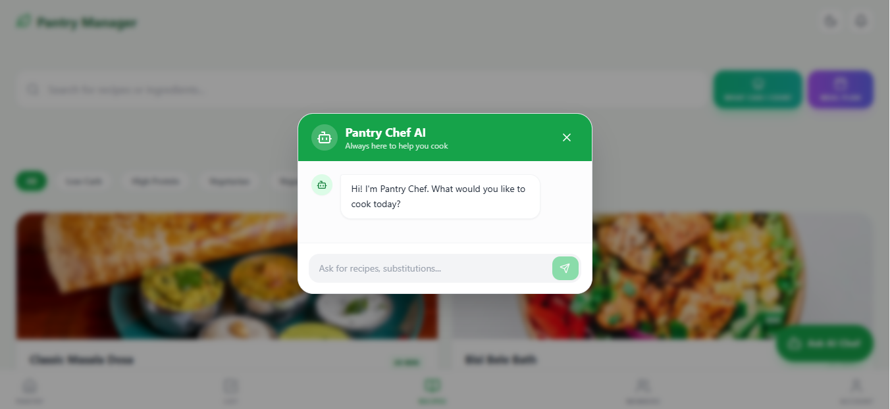
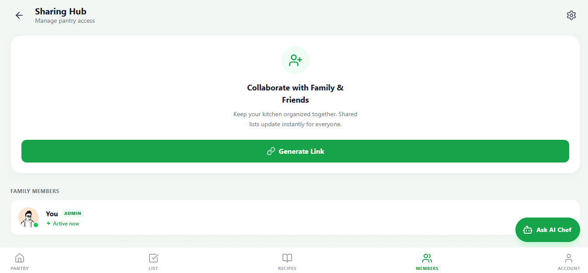
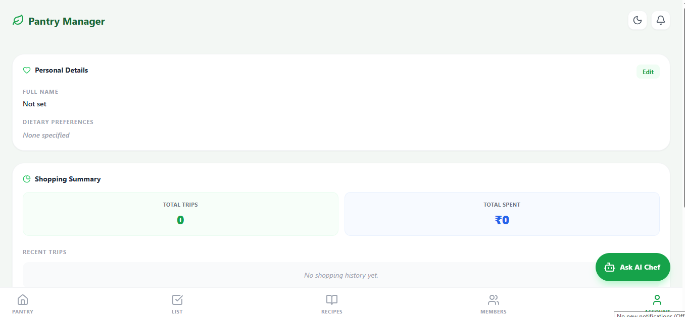

#  My Pantry - Intelligent Grocery & Kitchen Manager

My Pantry is a state-of-the-art, full-stack application designed to revolutionize how households manage their food inventory, plan meals, and reduce waste. By combining real-time inventory tracking with Generative AI, My Pantry turns a simple list into an intelligent kitchen assistant.

## Deployed Links
*   **Live Application**: [https://manageyourpantry.netlify.app/](https://manageyourpantry.netlify.app/)
*   **Backend API**: [https://grocery-manager-backend.onrender.com/api](https://grocery-manager-backend.onrender.com/api)
*   **Video Demo**: [https://drive.google.com/file/d/1FB9vrtzQGWKTTHCxLoSg1LFypjGk6ppC/view?usp=sharing](https://drive.google.com/file/d/1FB9vrtzQGWKTTHCxLoSg1LFypjGk6ppC/view?usp=sharing)

##  Test Credentials
*   **Email**: `test@example.com`
*   **Password**: `password123`

---

## Features Implemented

*   **Smart List Creation & Organization:** Automatically categorizes shopping list items by store sections (e.g., Produce, Dairy, Grains) to ensure highly efficient, layout-optimized grocery runs.
*   **Context-Aware Recipe Engine:** Suggests actionable recipes by cross-referencing user dietary preferences (e.g., vegetarian, gluten-free) with real-time pantry inventory, maximizing ingredient utilization and minimizing food waste.
*   **Real-Time Collaborative Lists:** Powered by WebSockets, allows multiple household members to simultaneously add, edit, or check off items on a unified grocery list with zero lag.
*   **AI Price Estimation & Live Budgeting:** Integrates generative AI to estimate item costs on the fly, paired with a dynamic visual budget bar that warns users before they exceed their defined financial limits.
*   **Store Deal & Coupon Integration:** Automatically surfaces relevant store deals and applies percentage-based discounts to grocery items, ensuring the most cost-effective shopping trips.
*   **Virtual Pantry & Inventory Tracking:** Maintains a persistent ledger of household ingredients. Automatically detects low-stock items based on user-defined thresholds and provides 1-click conversion to the shopping list.
*   **Dedicated Shopping Mode:** A streamlined, distraction-free mobile UI designed for in-store use. Features oversized tap targets, real-time cost accumulation, and one-click "Log Trip" functionality.
*   **Meal Planning & Scheduling:** Allows users to log prepared meals from recipes, which strictly updates inventory consumption and accurately tallies tracking nutritional intakes.
*   **Expiration Date Tracking:** Actively monitors perishable items, prominently alerting users to items set to expire within 7 days in varying alert colors to reduce household food waste.
*   **Comprehensive Health & Nutrition Tracking:** Leverages AI to estimate macros (Calories, Protein, Carbs, Fat) for grocery purchases, visualizing aggregate nutritional intake within the Analytics dashboard.
*   **Shopping History & Trend Analytics:** Logs every completed checkout trip to provide historical insights, rendering beautiful SVG pie charts and progress bars to illustrate spending patterns and category breakdowns over time.

---

##  Tech Stack
*   **Frontend**: React.js (Vite)
*   **Styling**: Tailwind CSS
*   **UI Components**: ShadCN UI + Framer Motion
*   **State Management**: React Context API
*   **Icons**: Lucide React
*   **HTTP Client**: Axios

---

##  Folder Structure
*   `src/components`: Reusable UI components and complex layout structures.
*   `src/pages`: Main application views and routing logic.
*   `src/context`: Global state management for Auth, Theme, and Notifications.
*   `src/services`: Centralized Axios instance and API call orchestration.
*   `src/utils`: Helper functions and schema validators.

---

##  Installation Steps

1.  **Clone the Repository**:
    ```bash
    git clone [FRONTEND_REPO_URL]
    cd frontend
    ```
2.  **Install Dependencies**:
    ```bash
    npm install
    ```
3.  **Configure Environment Variables**:
    Create a `.env` file in the root:
    ```env
    VITE_SUPABASE_URL=your_supabase_url
    VITE_SUPABASE_ANON_KEY=your_supabase_anon_key
    VITE_API_URL=http://localhost:5001/api
    ```
4.  **Launch Dashboard**:
    ```bash
    npm run dev
    ```

---

##  Screenshots











---

## Video Walkthrough
[https://drive.google.com/file/d/1FB9vrtzQGWKTTHCxLoSg1LFypjGk6ppC/view?usp=sharing](https://drive.google.com/file/d/1FB9vrtzQGWKTTHCxLoSg1LFypjGk6ppC/view?usp=sharing)
